# Visão geral da demanda
<a href="#top">(inicio)</a>

Essa demanda visa remodelar da Pesquisa Avançada do Portal de Transparência (PdT) a partir de sugestões dos usuários coletadas no '*Projeto Experiência do Usuário no Portal da Transparência*'.

Dentre as principais alterações estão a melhoria da usabilidade, uso de linguagem mais cidadã, a inclusão de novos filtros e alterações do layout utilizando funcionalidades que facilitem a navegação do usuário,  

As alterações serão realizadas na pesquisa avançada de 12 consultas:

1. Despesa
2. Restos a Pagar
3. Receita
4. Compras e Contratos
5. Patrimônio
6. Frota
7. Convênios de Entrada
8. Convênios de Saída
9. Proposta orçamentária
10. Alteração Orçamentária
11. Crédito Orçamentário
12. Viagens

A solução aplicada na construção da pesquisa avançada deve ser flexível para que outros filtros possam ser inseridos tanto na *Barra de Navegação Vertical* como na tabela *Adicionar/Remover Colunas* mediante provocação da CGE.

# Motivação / contexto da demanda
<a href="#top">(inicio)</a>

A partir da necessidade de implementação de melhorias no Portal da Transparência foi realizado o '*Projeto Experiência do Usuário no Portal da Transparência*' em parceria com a equipe do Laboratório de Inovação (LAB.MG) - SEPLAG. O projeto teve como objetivo auxiliar no entendimento do perfil geral dos usuários e tendências de comportamento durante a navegação nas páginas, identificar pontos críticos, sugestões de melhoria e novas informações que podem ser inseridas no Portal com o objetivo de melhorar a experiência dos usuários.

A identificação das principais necessidades de alteração do Portal foram coletadas através da aplicação de entrevistas, testes de usabilidade, disponibilização de formulários e elaboração de um diagnóstico realizado pela equipe LAB.MG.

Todas as ideias geradas ao longo do Projeto foram consolidadas em uma planilha denominada [Consolidado de Sugestões de Melhoria](https://docs.google.com/spreadsheets/d/1IPKqSnfbys6oQNQGjB24FOo0dUu-uqUC/edit#gid=1059189781). Ao todo foram 285 ideias captadas, sendo que dessas 58 estão relacionadas a melhoria na pesquisa avançada.

# Especificação
<a href="#top">(inicio)</a>

Esse documento tem como base a remodelagem das pesquisas avançadas do PdT. Abaixo segue as principais intervenções que deverão ser implementadas:

* Alteração do layout do ícone ***[Pesquisa Avançada]***
* Inclusão da Barra de Navegação vertical, da Barra Deslizante e do campo Filtros Aplicados;
* Alteração da tabela de resultado com novas funcionalidades; e
* Inclusão de novas opções para compartilhamento nas redes sociais;

As particularidades, como por exemplo os filtros padrões, links, formulários e etc de cada consulta serão detalhados em capítulo específico.

#### Pontos de destaque

* O layout (tipografia, cores, gráficos) deverá seguir o padrão adotado no Pdt.
* A pesquisa avançada deverá ser **responsiva**, ou seja, se adaptar ao tamanho das telas dos dispositivos móveis.

## Página Inicial da consulta
<a href="#top">(inicio)</a>

Ao acessar qualquer consulta do PdT o ícone de acesso a **Pesquisa Avançada** será apresentado na parte superior esquerda da barra de pesquisa.

**OBS:** Para que o ícone tenha destaque na página inicial **não** adotar a cor vermelha usada atualmente.

Exemplo:

## Campos da  Pesquisa Avançada
<a href="#top">(inicio)</a>

A pesquisa Avançada será composta pelos seguintes componentes:

* Barra de navegação vertical com filtros;
* Barra deslizante com os parâmetros dos filtros;
* Filtros Aplicados;
* Tabela de Resultado;
* Compartilhamento nas redes sociais
* Extração de dados

### Barra de Navegação Vertical
<a href="#top">(inicio)</a>

 Atributos da barra de navegação vertical:

* Todos os filtros deverão apresentar tooltip.
* A lista de filtros será localizada a esquerda da tela. A DTA irá definir os filtros gerais e os filtros padrões que deverão ser exibidos em cada consulta.
* O usuário poderá exibir mais filtros ao clicar em ***(+) Mais Filtros*** ou ocultar ao clicar em ***(-) Menos Filtros*** (eg.[Ponto Frio](https://www.pontofrio.com.br/Informatica/?Filtro=C56&nid=201704)).   
Caso a quantidade de filtros ultrapasse o limite da tela deverá ser utilizado a barra de rolagem.

[Issues#47](https://github.com/transparencia-mg/especificacoes-portal-transparencia/issues/47)
--

* O usuário poderá realizar a busca de qualquer filtro na **barra de pesquisa**. A barra de pesquisa deverá possuir atributo [placeholder](https://www.w3schools.com/tags/att_input_placeholder.asp) para facilitar ou indicar como o campo deverá sem preenchido.

* Alguns filtros da barra de navegação também deverão possuir atributos *placeholder*. Em capítulo específico a DTA irá definir os filtros.

* A barra de navegação poderá ser **ocultada/exibida** ([*collapsed Sidebar*](https://www.w3schools.com/howto/howto_js_collapse_sidebar.asp)) a partir dos comandos (eg. [Portal de Transparência Federal](http://www.portaltransparencia.gov.br/despesas/programa-e-acao?ordenarPor=programa&direcao=asc))

    *	Ocultada => ao clicar no símbolo **[<<]** ou no botão **[<< Ocultar Filtros]**;
    * Exibida => ao clicar no botão **[<< Exibir Filtros]**

**OBS**: Ao ocultar a barra de navegação vertical dos demais conteúdos (tabela de resultados, campos aplicados e etc) serão reajustados na página.

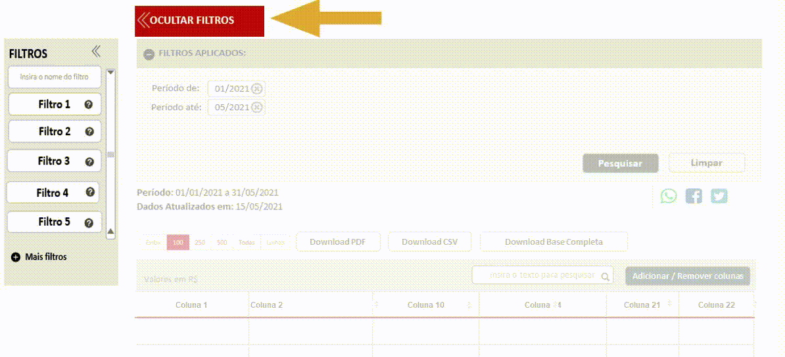

* Ao clicar em qualquer filtro da barra de navegação será exibido uma outra barra de filtros deslizante onde o usuário deverá selecionar os parâmetros da pesquisa.  
* A barra de navegação deverá indicar a seção em que o utilizador se encontra.

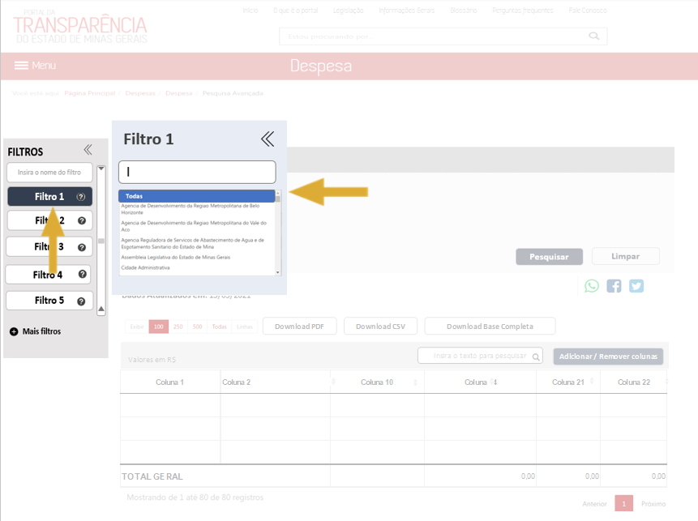

### Barra Deslizante <a href="#top">(inicio)</a>

* A barra deslizante só será exibida se o usuário clicar em algum filtro  da barra de navegação.
* A barra deslizante será **ocultada** a partir dos seguintes comandos (eg. [Portal de Transparência Federal](http://www.portaltransparencia.gov.br/despesas/programa-e-acao?ordenarPor=programa&direcao=asc) ):
   * ao clicar no ícone **[<<]**;
   * ao clicar em qualquer parte da tela, que não seja a barra de deslizante.  

* Quando a barra deslizante for ocultada a seção em que o utilizador se encontra deverá ser desativada e ao clicar em outro filtro na barra de navegação vertical a barra deslizante será exibida automaticamente.

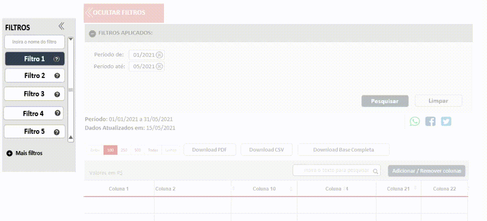

* Ao colocar o cursor do mouse sob a **barra de pesquisa** será exibido uma lista suspensa com todos os parâmetros referente ao filtro. Para selecionar o parâmetro desejado o usuário poderá usar a barra de rolagem ou a barra de pesquisa.  

* A barra deslizante deverá listar os parâmetros selecionados com a opção ***['x']() (excluir)***. O usuário poderá remover os parâmetros não desejados clicando no ***['x']()***.

* O usuário poderá combinar vários parâmetros para o mesmo filtro (selecionar mais de um item) ou selecionar a opção ***[Todos]***.
* Ao selecionar ***[Todos]***, serão exibidos todos os parâmetros daquele filtro com a opção ***['x']() (excluir)***. O usuário poderá remover os parâmetros não desejados clicando no ***['x']()***.

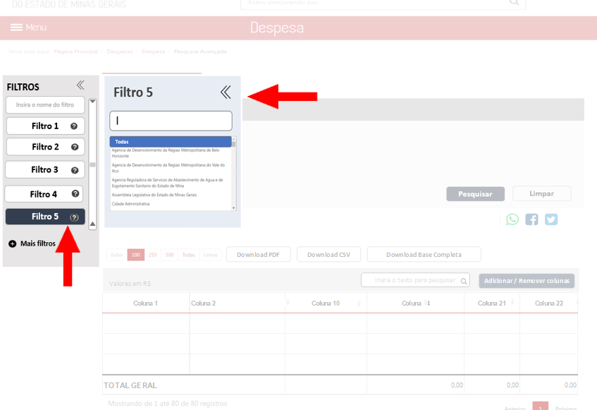

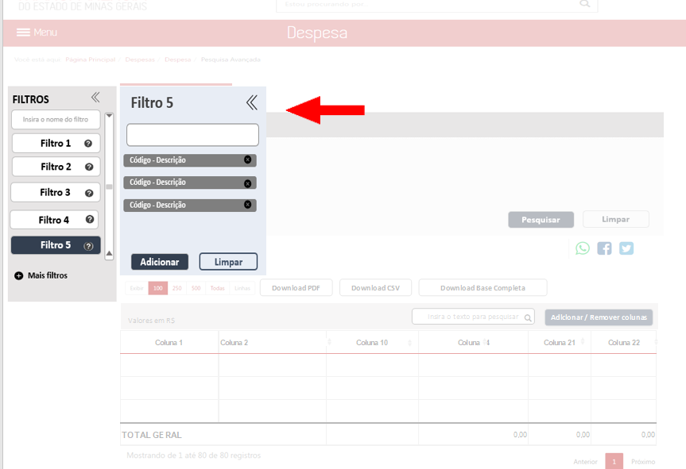

* Ao finalizar a seleção o usuário deverá clicar em **Adicionar** ou em **Limpar** caso queira desmarcar todas as opções.

  * Os botões **Adicionar/Limpar** devem ser estilisticamente diferenciados (eg. [*Differentiate button types*](https://medium.com/nextux/design-better-buttons-6b64eb7f13bc#aj%20la%20lb))

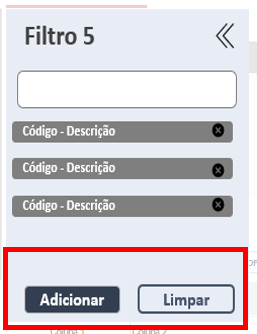

* Ao selecionar o período específico a barra deslizante de cada filtro irá exibir como parâmetros apenas as classificações orçamentárias vigentes no ano. A exceção será para a consulta de Restos a Pagar, onde os parâmetros da barra deslizante irá refletir apenas as classificações orçamentárias inscritas em restos a pagar, e não a classificação orçamentária vigente no ano.

* A medida que o usuário selecionar um parâmetro de qualquer filtro automaticamente apenas as opções que possuem relacionamento com o parâmetro selecionado será exibida nos demais filtros.    

  Exemplo:   
Ao selecionar o parâmetro '1521- Controladoria-Geral do Estado' no filtro *Órgão* e em seguida clicar no filtro *Programa* apenas os programas que tiveram execução na Controladoria-Geral do Estado naquele ano serão exibidos.

* Todos os parâmetros selecionados serão exibidos no campo **Filtros Aplicados**.

### Filtros Aplicados
<a href="#top">(inicio)</a>

* O usuário poderá **ocultar/exibir** o conteúdo do campo filtros aplicados a partir do comandos: (eg. [Portal de Transparência Federal](http://www.portaltransparencia.gov.br/despesas/programa-e-acao?ordenarPor=programa&direcao=asc) ).

  * **[+]**: Exibi o conteúdo do campo;
  * **[-]**: Oculta o conteúdo do campo. Ao ocultar os dados do campo os demais conteúdos da tela serão ajustados na página.
  .
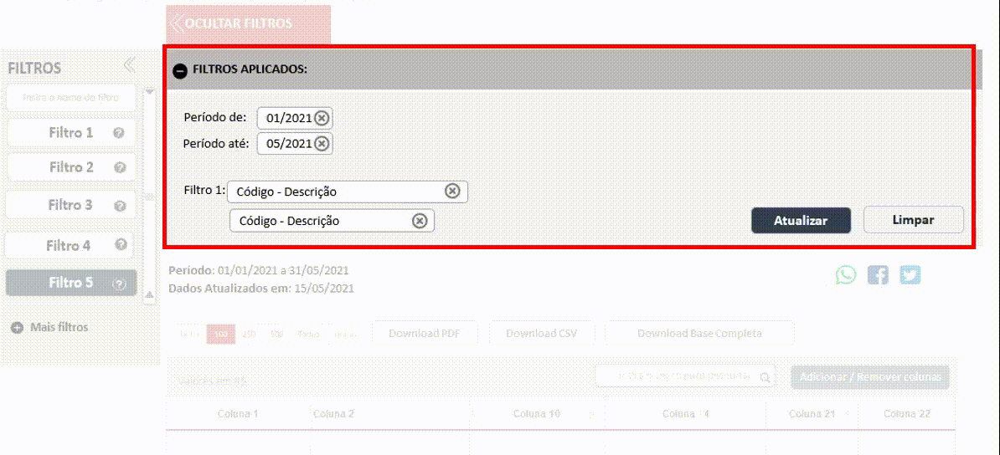

* Como padrão o filtro **Período** será exibido no campo filtros aplicados. O período exibido será o mm/aaaa inicial do exercício vigente até o mm/aaaa da última atualização dos dados.

* O campo filtro aplicados será composto pelos botões: Pesquisar, Atualizar e Limpar:

  * A posição na tela dos botões Pesquisar e Atualizar será a mesma, sendo a exebição de um ou outro realizada de acordo com as regras abaixo.
  * Pesquisar: será exibido após o usuário selecionar qualquer parâmetro na barra deslizante.  O Usuário deverá clicar em pesquisar para exibir o resultado desejado.
  * Atualizar: será exibido quando o usuário remover/adicionar algum parâmetro, ou seja, fizer qualquer alteração no campo filtros aplicados.
  * Limpar: ficará disponível sempre que houver pelo menos um parâmetro selecionado. Ao clicar nesse botão será excluído todo o conteúdo desse campo.

OBS: Os botões **Pesquisar/ Atualizar/Limpar** devem ser estilisticamente diferenciados (eg. [*Differentiate button types*](https://medium.com/nextux/design-better-buttons-6b64eb7f13bc#aj%20la%20lb))

* Casos os parâmetros selecionados não retornem nenhuma informação o PdT deverá apresentar uma mensagem informando que '*Não há dados a serem exibidos com os parâmetros selecionados.*''

* Os parâmetros selecionados na barra deslizante deverão ser exibidos na ordem que o usuário escolheu.

* Todos os parâmetros serão representados no campo filtros aplicados da seguinte forma:
  * **Filtro** (*nome do filtro*): **Parâmentro** (*nome do parâmetro*)-(**[X]()**)(*excluir*);

* À medida que o usuário for incluindo parâmetros na pesquisa a tabela de resultados será deslocada para baixo quando ultrapassar o limite da tela (eg. [Portal de Transparência Federal](http://www.portaltransparencia.gov.br/despesas/programa-e-acao?ordenarPor=programa&direcao=asc)).

### Tabela de resultados
<a href="#top">(inicio)</a>

* A tabela de resultado levará em consideração os parâmetros do campo filtros aplicados.

* A tabela apresentará colunas padrões que serão exibidas independentemente de o usuário selecionar/aplicar algum filtro. A DTA irá definir as colunas que deverão ser exibidos em cada consulta.

* A data de atualização dos dados, o período e os canais de compartilhamento (Facebook, Twitter e WhatsApp) serão exibidos acima da tabela de resultados.

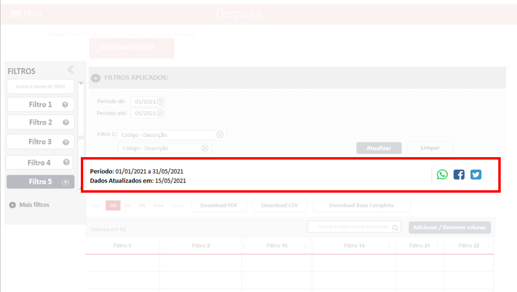

[Issues#44](https://github.com/transparencia-mg/especificacoes-portal-transparencia/issues/44)
--
* Os valores **TOTAL GERAL** e o **SUBTOTAL** serão exibidos na tabela de resultados de acordo com o comportamento do usuário:

  * TOTAL GERAL: quando o usuário não aplicar nenhum filtro na tabela ou quanto todos os dados forem exibidos em uma única página, ou seja, sem paginação;   

  * SUBTOTAL: quando o usuário aplicar qualquer filtros na tabela através da barra de pesquisa ou quando houver paginação no tabela de resultado, ou seja, houver mais de uma página de resultado.

* A tabela de resultados não exibirá os campos **TOTAL GERAL** e o **SUBTOTAL** quando não houver dados referentes a valores.

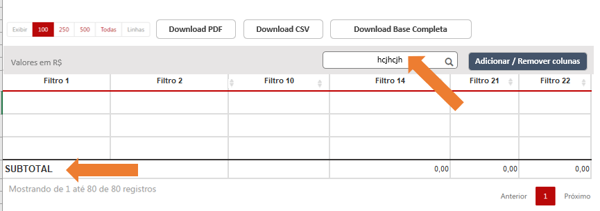

* A **barra de pesquisa** da tabela de resultado deverá retornar os dados da tabela que estão exibidos. A medida que o usuário for digitando os dados a busca será acionada. O atributo *placeholder*: deve ser aplicado na barra de pesquisa.

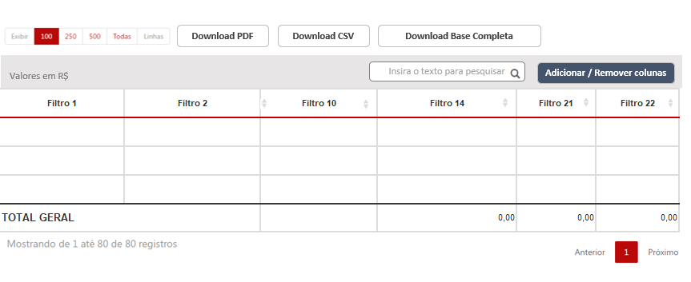

* Estrutura de design das tabelas de resultados:
  * Cabeçalho fixo - *[Fixer Header](https://medium.com/nextux/design-better-data-tables-4ecc99d23356#86cf)* (eg. [Consulta de Remuneração do PdT](http://www.transparencia.mg.gov.br/estado-pessoal/remuneracao-dos-servidores/remuneracao-faixa/202103/1/1038/4158/C/3251081/986/23239313));

  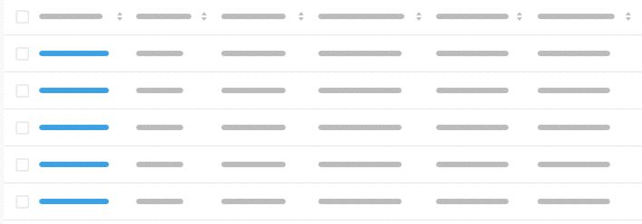

  * Rolagem horizontal - *[Horizontal Scroll](https://medium.com/nextux/design-better-data-tables-4ecc99d23356#2dba)*. Quando o número de colunas ultrapassar o limite da página o PdT deve possibilizar a rolagem horizontal.

  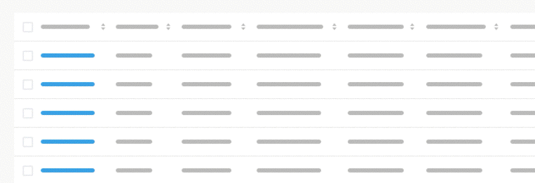

  * Colunas movíveis e classificáveis conforme ocorre atualmente;

  * Paginação e seleção da quantidade de linhas a serem exibidas, conforme ocorre atualmente;
  * O texto deve ser ajustável nas colunas, ou seja, caso seja necessário pode haver quebra de linha;

* O usuário poderá adicionar ou remover colunas - [*hide/show columns*](https://ux.stackexchange.com/a/110079) na tabela de resultados. Ao clicar em **Adicionar/Remover colunas** será exibido uma barra lateral a direta com todas as colunas que poderão ser adicionadas ou removidas (eg. [Portal da Transparência Federal](http://www.portaltransparencia.gov.br/despesas/consulta?ordenarPor=mesAno&direcao=desc)). A DTA irá definir a lista com as colunas de consulta .

* Ao exibir ou ocultar alguma coluna a tabela de resultados será atualizada automaticamente (eg.[Column Toggle Table](https://ux.stackexchange.com/questions/110077/best-practices-to-allow-user-to-hide-show-columns-in-a-data-table/110079#110079)).

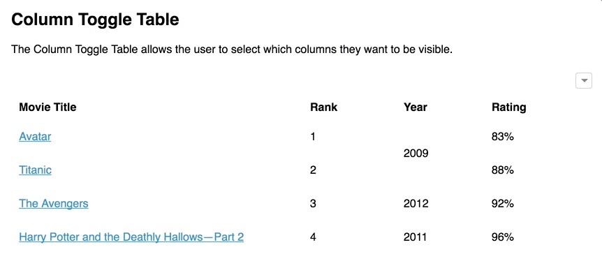

* O ícone **Adicionar/Remover Colunas** será ocultada/exibido a partir dos seguintes comandos:

  * Exibir / Ocultar: clicando no ícone
  * Ocultar: ao clicar em qualquer parte da tela, que não seja no ícone Adicionar/Remover Colunas.

* O ícone **Adicionar/Remover Colunas** além dos filtros pré-determinados pela DTA terá uma barra de pesquisa onde o usuário poderá digitar o filtro desejado.

* As colunas definidas como padrão ficarão marcadas na tabela ***Adicionar/Remover Colunas*** podendo o usuário desativá-las.

* Ao inserir qualquer coluna essas serão incluídas antes das colunas de valores. E caso seja incluída alguma coluna de valor essa será incluída ao final de todas as colunas.

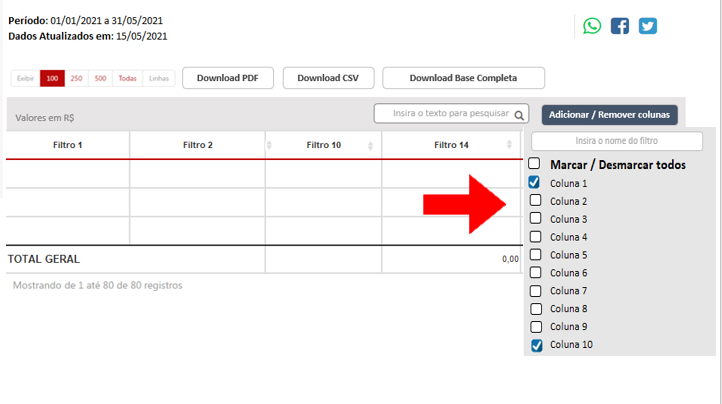

* Alguns filtros da tabela apresentará campos clicáveis (com link) que irá direcionar o usuário para o formulário de detalhamento da consulta (eg. [Consulta Compras e Contratos PdT](http://www.transparencia.mg.gov.br/compras-e-patrimonio/compras-e-contratos/comprasecontratos-resultado-pesquisa-avancada/2021/01-01-2021/31-12-2021/1831070/0/0/0/0/0/0/0/0/0/0/0/0/0/0/0/0/0/0/0/0/0/0/0/0/0/0/0/0/0/0/0/0/0/0/0/0/0/0)).

* Os campos clicáveis serão destacados conforme o layout já adotado pelo PdT e terão a imagem de uma lupa.

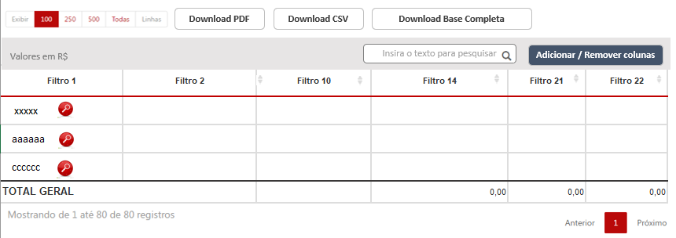

#### Download dos dados:

 [Issues#45](https://github.com/transparencia-mg/especificacoes-portal-transparencia/issues/45)
 --

  * PDF: O documento gerado em PDF deverá exibir:
    * a logo do Portal de Transparência no início da página;
    * a *URL*, a paginação e a data no fim da página.

*  O arquivo gerado irá exibir os mesmos dados apresentados na tela considerando todos os filtros aplicados e inclusive o **TOTAL GERAL** ou **SUBTOTAL** conforme o comportamento do usuário;

* CSV: Será exibido a tabela completa de todas as páginas, independente do filtro aplicado. O campo **TOTAL GERAL** também deverá ser exibido.

* Download Base Completa: Ao clicar no campo ***Download Base Completa*** o usuário será direcionado para o conjunto de dados da respectiva consulta no [Portal de Dados Abertos](https://dados.mg.gov.br/). O PdT deverá permitir que a equipe DTA inclua/altere a *url* desse campo através da área administrativa do Portal.

*  O PdT deverá permitir que por meio da área administrativa do Portal a equipe DTA decida se o campo ***Download Base Completa*** será exibido ou não na parte superior da tabela de resultado.

### Observações gerais:

* Todas as **barras de pesquisa** devem aceitar várias formas de preenchimento dos dados.
  * Autocompletar (*autocomplete* ) desde a primeira letra (eg. [Portal de Transparência MG](http://www.transparencia.mg.gov.br/planejamento-e-resultados/proposta-lei-orcamentaria/proposta-orcamentaria/proposta-pesquisa-avancada));
  * Desconsiderar acentuação, letras maiúsculas/minúsculas;
  * Desconsiderar palavras intermediárias (ex.: Ao digitar “gestao pública”, um dos resultados será “Gestão da Administração Pública”);
  * O usuário poderá pesquisar código ou descrição das classificações orçamentárias (eg. [Proposta Orçamentára - PdT MG](http://www.transparencia.mg.gov.br/planejamento-e-resultados/proposta-lei-orcamentaria/proposta-orcamentaria/proposta-pesquisa-avancada)).   

* Todos os filtros selecionados serão exibidos na tabela de resultado.

* A exibição de código e descrição será diferente em cada seção:

[Issues#43](https://github.com/transparencia-mg/especificacoes-portal-transparencia/issues/43)
--

 * Barra de pesquisa e filtros aplicados: exibir código e descrição no mesmo campo (eg. [Proposta Orçamentára - PdT MG](http://www.transparencia.mg.gov.br/planejamento-e-resultados/proposta-lei-orcamentaria/proposta-orcamentaria/proposta-pesquisa-avancada));
 * Tabela de resultado: exibir apenas descrição. Os códigos serão exibidos apenas se o usuário adicionar a coluna;
 * Opção exportar CSV.: exibir código e descrição em campos distintos, independente de o usuário selecionar a opção código na tabela de resultado.

## Filtros das consultas
<a href="#top">(inicio)</a>

#### Despesa
[issues#46](https://github.com/transparencia-mg/especificacoes-portal-transparencia/issues/46)

#### Restos a pagar

[issues#48](https://github.com/transparencia-mg/especificacoes-portal-transparencia/issues/48)

#### Receita
[issues#](https://github.com/transparencia-mg/especificacoes-portal-transparencia/issues/)
#### Compras e Contratos
[issues#](https://github.com/transparencia-mg/especificacoes-portal-transparencia/issues/)
#### Patrimônio
[issues#](https://github.com/transparencia-mg/especificacoes-portal-transparencia/issues/)
#### Frota
[issues#](https://github.com/transparencia-mg/especificacoes-portal-transparencia/issues/)
#### Convênios de Entrada
[issues#](https://github.com/transparencia-mg/especificacoes-portal-transparencia/issues/)
#### Convênios de Saída
[issues#](https://github.com/transparencia-mg/especificacoes-portal-transparencia/issues/)
####  Proposta orçamentária
[issues#](https://github.com/transparencia-mg/especificacoes-portal-transparencia/issues/)
#### Alteração Orçamentária
[issues#](https://github.com/transparencia-mg/especificacoes-portal-transparencia/issues/)
####  Crédito Orçamentário
[issues#](https://github.com/transparencia-mg/especificacoes-portal-transparencia/issues/)
#### Viagens
[issues#](https://github.com/transparencia-mg/especificacoes-portal-transparencia/issues/)
